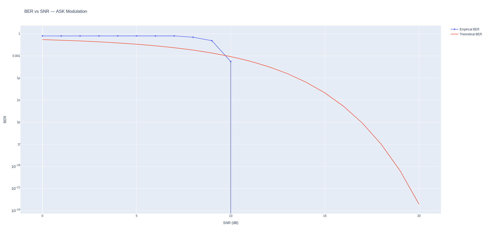

# Modulation Simulations — BER vs SNR Analysis

A Python-based project simulating various digital modulation schemes and evaluating their performance through **Bit Error Rate (BER)** analysis over an **AWGN channel**.

---

## Results Preview

| Modulation | Status |
|------------|--------|
| ASK (Amplitude Shift Keying) | ✅ Done |
| FSK (Frequency Shift Keying) | 🔄 In progress |
| PSK (Phase Shift Keying) | 🔄 In progress |
| QAM (Quadrature Amplitude Modulation) | 🔄 In progress |

> Each simulation compares **empirical BER** (via Monte Carlo) against the **theoretical BER curve**.

---

## Methodology

For each modulation scheme, the following pipeline is applied:

1. **Bit generation** — Random binary sequence
2. **Modulation** — Carrier signal modulated by the bit stream
3. **Normalization** — Signal power normalization before noise injection
4. **AWGN injection** — Additive White Gaussian Noise added at varying SNR levels (0–20 dB)
5. **Demodulation** — Signal recovery (e.g. Hilbert transform envelope detection for ASK)
6. **BER computation** — Empirical errors counted and compared to theoretical formula
7. **Visualization** — Interactive BER vs SNR plot (log scale) via Plotly

---

## Project Structure

    Project_Modulations/
    │
    ├── ASK/
    │   ├── ask_simulation.py
    │   └── ask_ber_vs_snr.png
    │
    ├── FSK/                        # Coming soon
    ├── PSK/                        # Coming soon
    ├── QAM/                        # Coming soon
    │
    └── README.md

---

## Requirements

```bash
pip install numpy scipy plotly
```

| Library | Purpose |
|---------|---------|
| `numpy` | Array operations, signal generation |
| `scipy` | Hilbert transform, `erfc` for theoretical BER |
| `plotly` | Interactive BER vs SNR visualization |

---

## Usage

Clone the repository and run any simulation script:

```bash
git clone https://github.com/maxwells-nabla/Project_Modulations.git
cd Project_Modulations/ASK
python ask_simulation.py
```

An interactive Plotly chart will open in your browser.

---

## Simulation Parameters

| Parameter | Value for ASK |
|-----------|-------|
| Number of bits | 100,000 |
| Sampling rate `fs` | 100,000 Hz |
| Carrier frequency `fc` | 5,000 Hz |
| Samples per bit `ns` | 100 |
| SNR range | 0 – 20 dB |

---

## Sample Output — ASK



> The empirical BER closely follows the theoretical curve, `0.5 · erfc(√(SNR/2))`, until 10 dB (when the linear empirical BER drops to 0), validating the simulation.

---

## License

This project is open-source under the [MIT License](LICENSE).

---

*Project by [Rodrigo Avezuela Zurita] — feel free to open an issue or PR for suggestions.*
